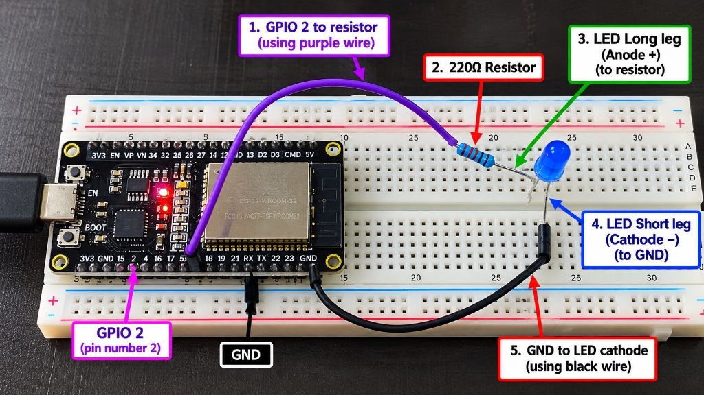

# ESP32 LED & Buzzer
*Simple Electronics Documentation for Class 7 - 9*

---

## 1. What is an ESP32?
An **ESP32** is a small computer board called a microcontroller. It can control LEDs, buzzers, buttons and sensors.

---

## 2. What is a Breadboard?
A **breadboard** helps us build circuits without soldering. Jumper wires connect the components.

---

## 3. Parts We Used

| Part | Purpose |
| --- | --- |
| **ESP32** | Controls the circuit using a program. |
| **Breadboard** | Connects parts without soldering. |
| **LED** | Produces light. |
| **Resistor** | Limits current and protects the LED. |
| **Buzzer** | Produces sound. |
| **Jumper wire** | Connects circuit points. |

---

## 4. LED Circuit
An LED has two legs. The **long leg is Anode (+)** and the **short leg is Cathode (-)**. Use a resistor with a normal LED.

### How to Connect the LED — Step by Step

* **Step 1 — Find GPIO 2:** On the ESP32, use pin **GPIO 2**. Connect one jumper wire from GPIO 2 to an empty row on the breadboard.
* **Step 2 — Add the 220Ω resistor:** Place one end of the resistor in the same breadboard row connected to GPIO 2. Put the other end in a different row.
* **Step 3 — Identify the LED legs:** The **longer leg is the anode (+)**. The **shorter leg is the cathode (-)**. If the legs have already been cut, the flat edge on the LED body usually marks the cathode side.
* **Step 4 — Connect the LED anode:** Connect the LED's **long leg (+)** to the resistor's free end.
* **Step 5 — Connect the LED cathode:** Connect the LED's **short leg (-)** to **GND** using a jumper wire.
* **Step 6 — Check before running:** Make sure the LED legs are not accidentally in the same breadboard row, the resistor is in series with the LED, and GND is connected to the LED's short leg.

#### Simple Connection Path
**ESP32 GPIO 2** $\rightarrow$ **220Ω resistor** $\rightarrow$ **LED long leg (+)** $\rightarrow$ **LED short leg (-)** $\rightarrow$ **GND**

> 💡 **Think of it like a road:** Electricity leaves GPIO 2, passes through the resistor and LED, and returns through GND.

### Wiring Layout



```text
[ ESP32 ]
  GPIO 2 -------- [ 220 ohm resistor ] -------- [ + Anode ]
                                                  ( LED )
  GND ----------------------------------------- [ - Cathode ]
```

---

## 5. LED Blink Program (CircuitPython)

```python
import board
import digitalio
import time

led = digitalio.DigitalInOut(board.IO2)
led.direction = digitalio.Direction.OUTPUT

while True:
    led.value = True
    time.sleep(1)
    led.value = False
    time.sleep(1)
```

> **How it works:** The LED turns **ON** for 1 second, **OFF** for 1 second, and repeats.

---

## 6. Buzzer Circuit
A **buzzer** changes electrical signals into sound. If the buzzer has a `+` mark, connect that side to the control pin.

### Wiring Layout
```text
[ ESP32 ]
  GPIO 2 -------------------------------------- [ + ]
                                              ( BUZZER )
  GND ----------------------------------------- [ - ]
```

**Connection:** `Buzzer (+)` $\rightarrow$ `GPIO 2` and `Buzzer (-)` $\rightarrow$ `GND`.

---

## 7. Buzzer Program (CircuitPython)

```python
import board
import digitalio

buzzer = digitalio.DigitalInOut(board.IO2)
buzzer.direction = digitalio.Direction.OUTPUT
buzzer.value = True
```

> **Note:** This keeps the output **ON**. Some buzzers are passive and need a changing signal such as PWM to make a tone.

---

## 8. Important Safety Rules
1. **Check + and -** before connecting a component.
2. **Use a resistor** with a normal LED.
3. **Do not randomly join** ESP32 pins together.
4. **Disconnect USB power** before changing complicated wiring.
5. **Ask your teacher** if you are unsure.

---

## 9. New Words

| Word | Simple meaning |
| --- | --- |
| **GPIO** | An ESP32 pin used to send or receive a signal. |
| **HIGH / True** | Output is ON. |
| **LOW / False** | Output is OFF. |
| **GND** | Ground; the return path of the circuit. |
| **CircuitPython** | Python used to program microcontroller boards. |

---

## 10. Student Challenge
> 💡 **Try it!** Make the LED blink three times. Then make the buzzer beep. Change the delay and observe what happens.

---

## 11. Quick Questions
1. What does LED stand for?
2. Which LED leg is the Anode?
3. Why do we use a resistor?
4. What does GND mean?
5. What does a buzzer produce?
6. Which GPIO pin did we use?
